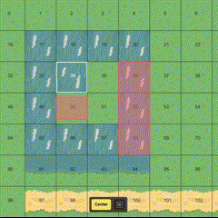

### Level Editor

The Level Creator is the heart of the game. Without it, no new levels could be created.

From a technical point of view, maps and their meta values (collisions, game objects, assignments) are first assembled from individual map pieces. When exported, the map is transformed into a single file that can then be played.

---

#### Create a new project
To create a new project, use the buttons in the bottom right-hand corner. A new pop-up opens in which various properties must be configured.

**Width and height**: Specifies the tile size of the map. This is not a tangible unit such as pixels, but merely the number of map parts. The larger the value, the larger the map.

**Pixel size**: The value indicates how many pixels represent a tile. For reasons of uniformity, the default value should always be used here. Deviations may not be accepted in a pull request.

**Name**: The name of the level can be freely selected and should be in English. It can also be configured afterwards. Please choose a short title that does **not yet imply the solution**. Here are a few examples: “The Gap of the Displaced Bridge”, 'The Hidden Valley', 'The Discolored Blossom'

**Translation Key**: If the title should also be translatable, please enter a unique key. It should be a single word that can be specifically assigned to your level. For example: “shifted-bridge”, “hidden-valley”, “discolored-blossom”.
The keys can then be translated under “levels.<translation_key>”.
By default, the assignment of a translation key is recommended. Only in exceptional cases does it make sense not to do so.

The project can then be created and opens automatically.

---

#### The Map
The map is located on the left-hand side. You can navigate on it and select, edit and change the individual tiles of the map. You can move around using the simple drag & hold method or with the arrow keys or W/A/S/D.

The mouse wheel can also be used to zoom in and out.

> **Note**: If you experience poor performance when moving the mouse, try zooming in as close as possible. This will render less content in the visible field and speed up the process. In addition, navigation using arrow keys can be significantly more performant, as only one calculation takes place per keystroke, not several times per second as with a mouse movement. 

